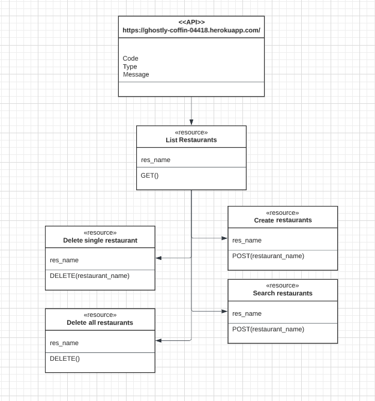

# Microservice CS_361

## URL: <https://ghostly-coffin-04418.herokuapp.com/>

## Routes

### POST

- `/add` - add restaurant to DB `body: {"name":"restaurant-name"}`

- `/compare` - returns restaurant name if in DB or empty list if not `body: {"name":"restaurant-name"}`

### GET

- `'/'` - get list of all restaurants

### DELETE

- `/remove` - removes restaurant with matching name from DB `body: {"name":"restaurant-name"}`
- `/remove-all` - removes all restaurants from DB

### Example

Restaurant List: `'Local Foods','Taco Truck','Dominos','Burgers-n-Stuff'`

POST: `https://ghostly-coffin-04418.herokuapp.com/compare`

`body: {"name":"Dominos"}`  

Result:
`{ res_name: "Dominos" }`

### UML

